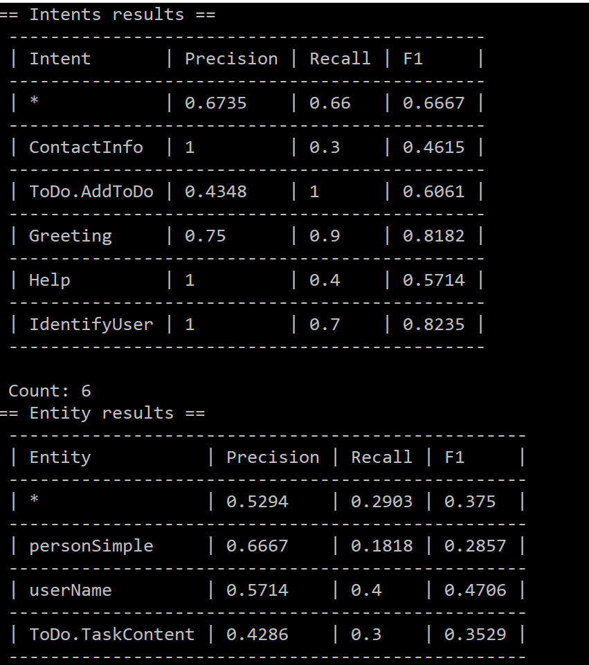

# NLU.DevOps confusion matrix calculations

This document describes how NLU.DevOps processes the results returned by NLU provider and describes how the confusion matrix metrics are computed and reported.

The compare sub-command compares the results returned from NLU provider with the labeled test set. It runs the comparison for 4 kinds of results:  
- Intents
- Entities
- Text
-  Entity Values
  
For each test utterance one or more confusion matrix results can be computed:
- True Positive (TP)
- True Negative (TN)
- False Positive (FP)
- False Negative (FN)

 The cases where more than one confusion matrix result is returned are as follows:
-	When actual and expected intents mismatch it returns a FP result for the intent that was matched and a FN result for the intent that was not matched.
-	When actual and expected entities mismatch, a FP result is returned for the entity that was matched and a FN result is returned for the entity that was not matched.
  
## Confusion matrix output for intent comparison
 
|Utterance text        | Actual Intent  | ExpectedIntent   | 
|:---------------------: | :------------: |:---------------:|
|who is bob goodermuth? | ContactInfo | ContactInfo|

**True Positive for ContactInfo:** The expected and actual intents are equal

| Utterance text        | Actual Intent  | ExpectedIntent   | 
|:---------------------: | :------------: |:---------------:|
|who is bob goodermuth? | Greeting | Greeting|

**True Negative for ContactInfo:** Actual intent is not ContactInfo, and the expected result it not ContactInfo

### Producing two results
| Utterance text        | Actual Intent  | ExpectedIntent   | 
|:---------------------: | :------------: |:---------------:|
|who is bob goodermuth? | Greeting | ContactInfo|

**False Positive** for Greeting and **False Negative** for ContactInfo since intents mismatch

## Confusion matrix output for entity comparison
When the expected list of entities is not empty, we check that each entity matches by type, value and by the occurence index of the matching text in the utterance.
| Utterance text        | Actual entities (startPos, endPos, type, value)	 | Expected entities (startPos, endPos, type, value)   | 
|:---------------------: | :------------: |:---------------:|
|Schedule meeting with bob tomorrow| 	26, 33, datetime, tomorrow   23, 25, personName, bob| 23, 25, personName, bob  26, 33, datetime, tomorrow|

**True Positive** for datetime and personName since they have a corresponding match in the actual entities based on entity type, text match and index match.

| Utterance text        | Actual entities (startPos, endPos, type, value)	 | Expected entities (startPos, endPos, type, value)   | 
|:---------------------: | :------------: |:---------------:|
|Schedule meeting with bob tomorrow| 	26, 33, datetime, tomorrow   23, 25, personName, bob| |

**False Positive** for datetime and personName since they don’t have a matching entity in the expected entities list.

| Utterance text        | Actual entities (startPos, endPos, type, value)	 | Expected entities (startPos, endPos, type, value)   | 
|:---------------------: | :------------: |:---------------:|
|Schedule meeting with bob | 	17, 24, personName, bob| 22, 24, personName, bob|
**False Positive** for personName since the start position doesn’t match with the expected one.

### Producing two results

| Utterance text        | Actual entities (startPos, endPos, type, value)	 | Expected entities (startPos, endPos, type, value)   | 
|:---------------------: | :------------: |:---------------:|
|Schedule meeting with bob | 	22, 24, userName, bob| 22, 24, personName, bob|

**False Positive** for userName since it doesn’t have a matching entity in the expected entities list 
**FalseNegative** for personName since it doesn’t have a corresponding match in the actual entities

| Utterance text        | Actual entities (startPos, endPos, type, value)	 | Expected entities (startPos, endPos, type, value)   | 
|:---------------------: | :------------: |:---------------:|
|Schedule meeting with bob tomorrow| 	| 23, 25, personName, bob   26, 33, datetime, tomorrow 

**False Negative** for personName and datetime since they don’t have a corresponding match in the actual entities26, 33, datetime, tomorrow 

| Utterance text        | Actual entities (startPos, endPos, type, value)	 | Expected entities (startPos, endPos, type, value)   | 
|:---------------------: | :------------: |:---------------:|
|Good Morning|  |

**True Negative:** There are no expected entities and no entities identified

## Confusion matrix output for entity value comparison 

Besides comparing entity values for the entities comparison we also compute True positive and False Negative metrics by comparing entity values only. 
| Utterance text        | Actual entity value	 | Expected entity value  | 
|:---------------------: | :------------: |:---------------:|
|Do I have unpaid bills?| "bills", "invoice",  "invoices"| bills|

**True Positive:** for bills since the entity matches by type, startPos and endPos and the expected value has match in the actual entity value subtree.

**True Negative:** Not calculated

**False Positive:** Not calculated

| Utterance text        | Actual entity value	 | Expected entity value  | 
|:---------------------: | :------------: |:---------------:|
|Do I have unpaid bills?| "bills", "invoice",  "invoices"| checks|

**False Negative:** for checks since the entity matches by type, startPos, endPos, but the value does not have the expected subtree in the entity resolution value

## Reporting F-measure
After computing the confusion matrix numbers, we compute the precision, recall and f1 score for each of intent and entity and the micro-average F-measure for intents and entities

We print out to the user the following tables that can inform the user on the performance of the model and help them make decisions on which intents or entities to improve.

